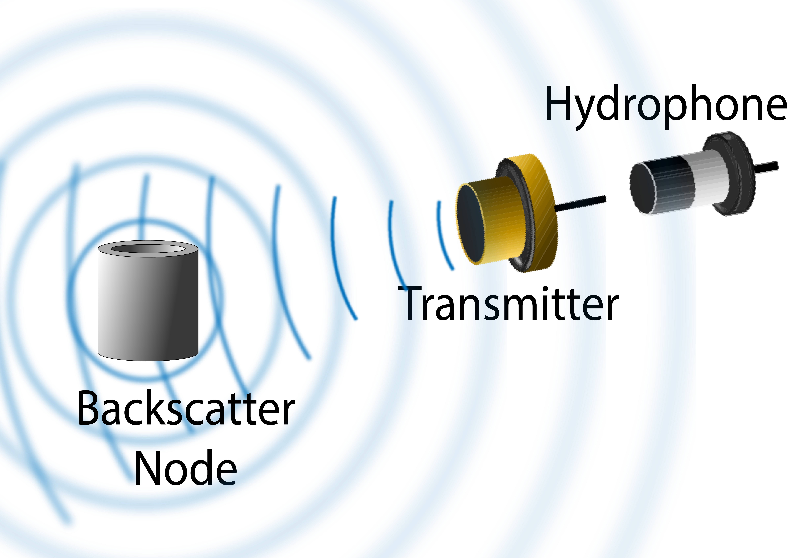

# Enabling Long-Range Underwater Backscatter via Van Atta Acoustic Networks

We present the design, implementation, and evaluation of Van Atta Acoustic Backscatter (VAB), a technology that enables long-range, ultra-low-power networking in underwater environments. At the core of VAB is a novel, scalable underwater backscatter architecture that bridges recent advances in RF backscatter (Van Atta architectures) with ultra-low-power underwater acoustic networks. Our design introduces multiple innovations across the networking stack, which enable it to overcome unique challenges that arise from the electro-mechanical properties of underwater backscatter and the challenging nature of low-power underwater acoustic channels. We implemented our design in an end-to-end system, and evaluated it in over 1,500 real-world experimental trials in a river and the ocean. Our evaluation demonstrates that VAB achieves a communication range that exceeds 300m in round trip backscatter across orientations (at BER of $10^{-3})$. We compared our design head-to-head with past state-of-the-art systems, demonstrating a $15\times$ improvement in communication range at the same throughput and power. By realizing hundreds of meters of range in underwater backscatter, this paper presents the first practical system capable of coastal monitoring applications. Finally, our evaluation represents the first experimental validation of underwater backscatter in the ocean. 

<figure>
    
    <figcaption style="text-align: center;"><strong>Traditional Underwater Backcsatter</strong></figcaption>
</figure>

<figure>
    
    <figcaption style="text-align: center;"><strong>Our Retroreflective Design</strong></figcaption>
</figure>

 This work builds on the work of [Underwater Backscatter](https://github.com/saadafzal24/Underwater-Backscatter), and contains a number of important improvements to the piezoelectric nodes, decoding pipeline, and most importantly the backscatter device architecture. 

## Contents

The repository is organized into the components that make up a full experimental VAB system:

- **Van Atta Array** (`vanatta`): Contains the switching PCB designs and simulation tools for a Van Atta array.
- **Transmitter / Reader** (`txrx`): Contains the hardware design files and source code for the transmit and receive pipelines in VAB, including the core multichannel DFE implementation. This system is an integrated hardware platform and thus is grouped into one folder. 
- **Piezoelectric Nodes** (`node`): Contains 3D models and hardware design files for the piezoelectric node manufacturing process. These nodes are used in the transmitter and the Van Atta array. 
- **Autorotator** (`autorotator`): Contains the 3D models and source code for running the "autorotator", the device we used in the original VAB paper to evaluate the Van Atta array across rotations. 

### Datasets

Datasets can be found under the corresponding wiki page. Unless otherwise specified, all datasets have a sampling rate of 44.1 kHz. 

## Getting Started

The best immediate first step would be to reproduce the paper results from the datasets using the multichannel DFE pipeline in the `txrx` folder. The remaining system components must be built and thus the development time is much longer. 

## Acknowledgement

**Authors**: [Aline Eid](https://alineeid.engin.umich.edu/), [Jack Rademacher](https://jackrademacher.me), [Waleed Akbar](https://signal-kinetics.media.mit.edu/people/waleed-akbar/), [Purui Wang](https://signal-kinetics.media.mit.edu/people/purui-wang/), [Ahmed Allam](https://ahmed-allam.com/), Fadel Adib

**Advisor/PI**: [Fadel Adib](http://www.mit.edu/~fadel/)

**Paper**: TBD
